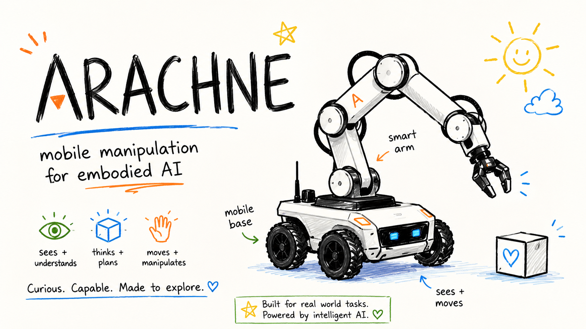
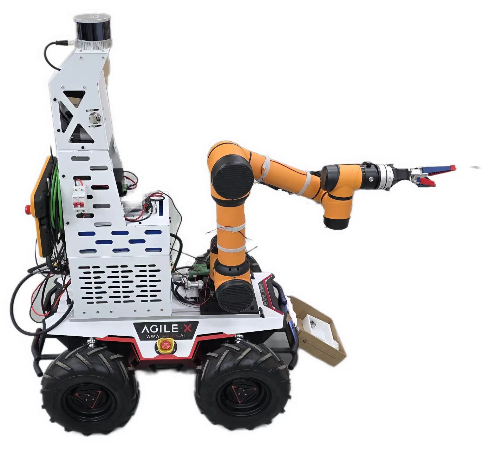
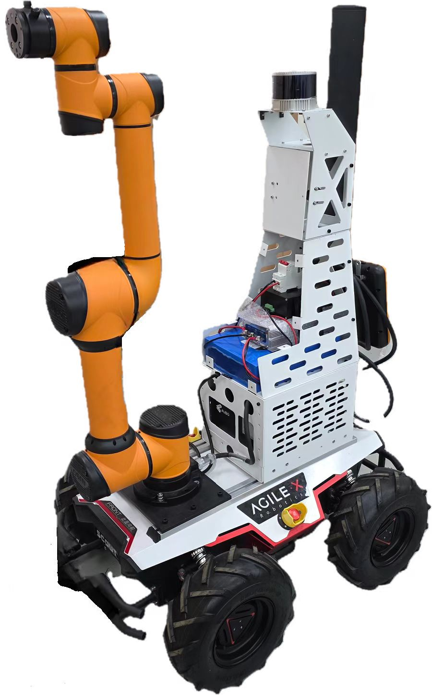
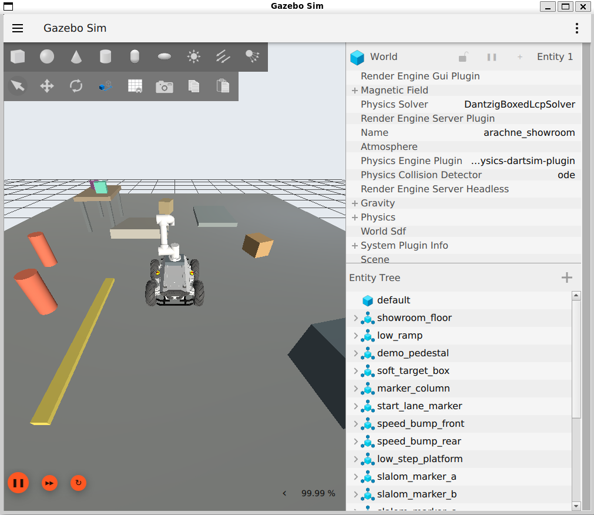
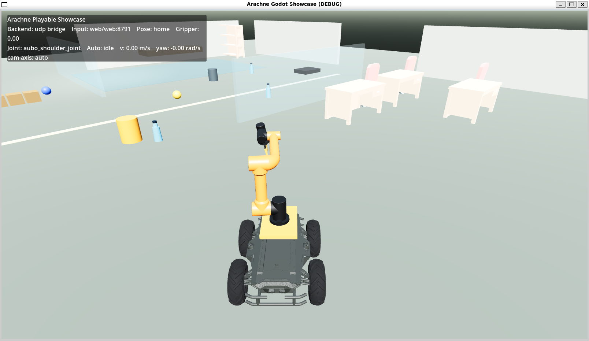

<p align="center">
  
</p>

# Arachne

[中文](README.md) · [Quick Start](#quick-start) · [Real Hardware](#real-hardware) · [Documentation](#documentation)


Arachne is a ROS 2 workspace for a mobile manipulation robot built around a Scout 2.0 base, an Aubo i5 arm, and an interchangeable gripper. The default hardware model uses the Yizhua Robot MS42DC two-finger flexible servo gripper; AG95 remains available as an open-source gripper variant.

The project provides a reproducible baseline for robot description, RViz/Gazebo/Godot demos, MoveIt2/Nav2/ros2_control starter configuration, and ROS-facing real-hardware bringup.

<table>
  <tr>
    <td width="50%" align="center"></td>
    <td width="50%" align="center"></td>
  </tr>
</table>

## Features

- Unified URDF/Xacro for Scout 2.0, Aubo i5, MS42DC, AG95, sensor frames, and mounting frames.
- Swappable grippers: user-created movable MS42DC split CAD parts plus the AG95 open-source model.
- Simulation and presentation: RViz model inspection, Gazebo gamepad demo, Gazebo autonomous pick validation, and a Godot high-FPS showcase.
- Control scaffold: MoveIt2, Nav2, ros2_control, sequence executor, and VLA/WAM action-chunk translator.
- Real-hardware interfaces for Scout 2.0, MS42DC, and Aubo i5 through ROS topics, launch files, and safety checks.

## Quick Start

Supported environments are Ubuntu 24.04 + ROS 2 Jazzy and Ubuntu 22.04 + ROS 2 Humble.

```bash
git clone https://github.com/zay002/Arachne.git
cd Arachne

./scripts/setup_ubuntu.sh
./scripts/fetch_third_party.sh

source scripts/arachne_env.sh
./scripts/build_workspace.sh
./scripts/view_model.sh
```

`arachne_env.sh` pins the current shell to the Ubuntu system Python used by ROS, such as `/usr/bin/python3.12` on Ubuntu 24.04 + Jazzy, so conda/pyenv Python 3.13 cannot hijack ROS Python modules.

`view_model.sh` starts the default MS42DC model, base teleop GUI, Aubo joint sliders, and gripper Open/Close controls.

## Common Commands

| Goal | Command |
| --- | --- |
| View the default MS42DC model | `./scripts/view_model.sh` |
| View the AG95 model | `./scripts/use_gripper.sh ag95 view` |
| Check URDF and core interfaces | `./scripts/check_workspace.sh` |
| Gazebo gamepad demo | `./scripts/switch_demo.sh` |
| Gazebo autonomous pick validation | `./scripts/gazebo_autopick_demo.sh` |
| Godot showcase | `./scripts/godot_showcase.sh` |
| Real-hardware environment check | `./scripts/check_real_hardware_env.sh` |
| Real one-command bringup | `./scripts/real_bringup.sh` |
| Real teach demo | `./scripts/real_teach_demo.sh` |
| Read-only Aubo connectivity probe | `./scripts/real_aubo_probe.sh` |
| Aubo startup state check | `./scripts/real_aubo_prepare.sh` |
| Aubo real driver bringup | `ARACHNE_CONFIRM_AUBO_DRIVER=YES ./scripts/real_aubo_bringup.sh` |
| Blocking Aubo remote startup | `ARACHNE_CONFIRM_AUBO_REMOTE_START=YES ./scripts/real_aubo_remote_start.sh` |
| Small Aubo Z test | `ARACHNE_CONFIRM_REAL_MOTION=YES ./scripts/real_aubo_z_test.sh` |
| Real teach and replay panel | `./scripts/teach_panel.sh` |

<p align="center">
  
  
</p>

## Real Hardware

Arachne keeps the real-hardware layer ROS-facing and uses official or vendor routes where they fit the deployed hardware.

| Device | Default interface | Notes |
| --- | --- | --- |
| Scout 2.0 | `scout_waveshare_serial_driver` | `/cmd_vel` to Scout v2 CAN frames through Waveshare USB-CAN-A, CH340 serial, default `/dev/serial/by-id/usb-1a86_USB_Serial-if00-port0` |
| MS42DC | `ms42dc_direct_serial_driver` | `/arachne/gripper/command` to Type-C serial frames. The gripper controller is CH91xx/CH343-family; the current unit is treated as the CH9012 path. Recommended alias: `/dev/motor_serial` |
| Aubo i5 | `AuboRobot/aubo_ros2_driver` | TCP/IP + ros2_control, launched with the robot IP |

Prepare real-hardware ROS packages:

```bash
./scripts/prepare_real_hardware_ros.sh
./scripts/real_aubo_probe.sh
./scripts/real_aubo_prepare.sh
```

Prefer completing connect -> power on -> start from the teach pendant/control cabinet. If ROS-side remote startup is needed, use only the blocking startup script: it first confirms active controllers, reads the measured joint angles, sends a hold-position command, then runs power on -> Aubo `RobotManage.startup` lifecycle startup -> post-Running steady-state and hold verification. The script never calls `releaseRobotBrake` directly; any protective state, timeout, or controller error aborts the flow.

Remote startup uses two terminals:

```bash
# Terminal 1: start the driver and allow pre-power controller activation
ARACHNE_CONFIRM_AUBO_DRIVER=YES ARACHNE_AUBO_ALLOW_PRESTART=YES ./scripts/real_aubo_bringup.sh

# Terminal 2: run the blocking remote-start state machine
ARACHNE_CONFIRM_AUBO_REMOTE_START=YES AUBO_ROBOT_IP=192.168.127.128 ./scripts/real_aubo_remote_start.sh
```

For day-to-day real-hardware work, use the automatic entry. It selects the Scout and MS42DC `/dev/serial/by-id` ports, checks that Aubo is Running / Normal, then starts the full bringup:

```bash
./scripts/real_bringup.sh
```

For WSL2, [hurry-porter](https://github.com/zay002/hurry-porter) is recommended for USB handoff, serial discovery, and Waveshare USB-CAN-A diagnostics.

```bash
hurry scan
hurry waveshare-can-a recv \
  --port /dev/serial/by-id/usb-1a86_USB_Serial-if00-port0 \
  --can-bitrate 500000 \
  --frame-type standard \
  --duration 2
```

Real motion tests are dry-run by default. Enable motion only after power, emergency stop, and clearance are confirmed:

```bash
./scripts/real_hardware_acceptance_test.sh
./scripts/real_aubo_z_test.sh
ARACHNE_CONFIRM_REAL_MOTION=YES ./scripts/real_hardware_acceptance_test.sh
```

For demonstrations, use the one-command teach entry:

```bash
./scripts/real_teach_demo.sh
```

It starts real bringup, waits for `/odom`, `/joint_states`, the Aubo trajectory action, and gripper status, then opens the teach panel. Closing the panel stops the background bringup. The panel manually controls the base, Aubo tool, and MS42DC gripper, records base pose, tool position, arm joints, and gripper state as waypoints, saves them under the local `recordings/teach/` directory, and replays the sequence slowly with one button.

## Project Layout

| Path | Purpose |
| --- | --- |
| `src/arachne_description` | Unified robot model, RViz config, gripper variants, and sensor frames |
| `src/arachne_demo` | Switch Pro controller, Gazebo showroom, autonomous pick validation |
| `src/arachne_hardware` | Real bringup, Scout/MS42DC wrappers, safety state, command gating |
| `src/arachne_control` | ros2_control names, mock controllers, hardware profiles |
| `src/arachne_moveit_config` | MoveIt2 starter config for Aubo i5 with MS42DC or AG95 |
| `src/arachne_nav` | Nav2 starter config for Scout |
| `src/arachne_operator` | Operator panel, sequence executor, VLA/WAM action-chunk translator |
| `godot/arachne_showcase` | Godot 4.x third-person showcase frontend |
| `docs` | Modeling, control, hardware, calibration, reports, and references |

## Documentation

- [Modeling](docs/modeling.md)
- [Control](docs/control.md)
- [Hardware](docs/hardware.md)
- [Calibration](docs/calibration.md)
- [References](docs/references.md)
- [Stage reports](docs/reports)

Chinese versions are available as matching `*.zh-CN.md` files.

## Roadmap

- Validate Aubo i5 TCP/IP and ros2_control on real hardware.
- Stabilize the combined Scout, Aubo, and MS42DC bringup with safety gates.
- Replace the lightweight Gazebo autonomous-pick planner with MoveIt2 and ros2_control controllers.
- Extend Nav2 with real odometry, localization, and sensors.
- Connect the Godot frontend to ROS 2 through the prepared bridge layer.

## License

Repository code is released under the [MIT License](LICENSE). Third-party models, CAD files, SDKs, and manuals retain their original licenses; sources are tracked in [third_party/README.md](third_party/README.md) and [docs/references.md](docs/references.md).
