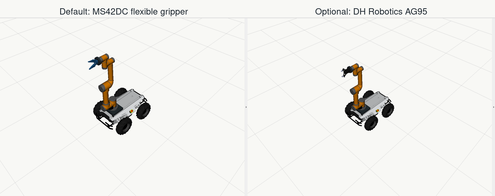

<p align="center">
  
</p>

# Arachne

[中文文档](README.zh-CN.md)

Arachne is a ROS2 workspace for a Scout 2.0 mobile base carrying an Aubo i5 arm and a selectable gripper. The two model variants share the same base, arm, mount, sensor frames, launch flow, and gripper interface; the only model difference is the gripper.

The default hardware model is Scout 2.0 + Aubo i5 + Yizhua Robot MS42DC two-finger flexible servo gripper. AG95 is kept as an open-source gripper variant for comparison and demos. Both grippers are exposed through the same `Open` / `Close` GUI and service interface.

The current milestone is a reliable robot description and RViz demo: one connected TF tree, real upstream Scout/Aubo/AG95 descriptions, a user-created movable MS42DC split mesh model, and lightweight gripper open/close simulation.

## What Is Included

- `src/arachne_description`: unified Xacro/URDF, RViz config, model variants, mount frames, sensor frames, and MS42DC/AG95 gripper adapters.
- `src/arachne_sim`: RViz-oriented base simulation, `/cmd_vel` integration, odometry TF, wheel joint states, and a small base teleop GUI.
- `src/arachne_gripper`: simulated gripper controller, joint-state mux, and a small `Open` / `Close` GUI.
- `src/arachne_demo`: Nintendo Switch controller teleop, RViz demo launch, and Gazebo showroom launch.
- `src/arachne_hardware`: reserved real-hardware driver package with empty files for gripper serial, base serial, and Aubo TCP/IP drivers.
- `scripts`: setup, third-party fetch, model visualization, URDF check, and gripper smoke-test helpers.
- `docs`: hardware/modeling/control/calibration notes and stage reports.
- `docs/demo/model_compare.png`: current MS42DC and AG95 model showcase.
- `third_party/MS42DC.step` and `third_party/MS42DC_SPLIT/*.stl`: source CAD and user-created movable split parts for the MS42DC gripper.

Large upstream repositories under `third_party/` are intentionally ignored by git. They are restored with `scripts/fetch_third_party.sh` and pinned in that script for reproducible setup. Generated `build/`, `install/`, `log/`, and local planning notes such as `plan.md` are also ignored.

## Current State

- Scout 2.0, Aubo i5, MS42DC, AG95, lidar, and optional end-effector camera are composed into one robot model.
- The MS42DC and AG95 variants differ only at the gripper under `gripper_adapter_link`.
- Aubo is mounted at the current intended Scout top-deck pose.
- MS42DC uses user-created split CAD meshes with revolute left/right finger links.
- MS42DC close target is calibrated to `0.6 rad` by default.
- RViz starts through `scripts/view_model.sh`, which cleans stale visualization nodes and launches base teleop, arm joint sliders, gripper simulator, and gripper Open/Close GUI.
- The arm slider GUI starts from the current user-confirmed display pose; pressing `Center` returns to that pose.
- `scripts/switch_demo.sh` starts an interactive Nintendo Switch controller demo for the base, Aubo joints, and gripper.

## Roadmap

1. Finalize physical calibration: tool adapter pose, sensor poses, and collision simplification for planning.
2. Add MoveIt2 configuration for the Aubo arm with interchangeable MS42DC and AG95 end-effectors.
3. Replace the lightweight RViz base integrator with a full simulation backend when physics and collision rehearsal are needed.
4. Implement hardware-facing bridges for Aubo TCP/IP, Scout serial, and MS42DC serial after the remaining materials arrive.
5. Build the operator Web UI after the model, controllers, and launch contracts are stable.

## Quick Start

Recommended environments:

- Ubuntu 24.04 + ROS2 Jazzy
- Ubuntu 22.04 + ROS2 Humble

```bash
cd Arachne
./scripts/setup_ubuntu.sh
./scripts/fetch_third_party.sh

# If Conda is active, deactivate it before building ROS packages.
conda deactivate 2>/dev/null || true
source /opt/ros/jazzy/setup.bash  # use /opt/ros/humble/setup.bash on Ubuntu 22.04

colcon build --base-paths src --packages-select \
  aubo_description scout_description dh_ag95_description \
  arachne_sim arachne_gripper arachne_hardware arachne_description arachne_demo \
  --cmake-args -DPython3_EXECUTABLE=/usr/bin/python3

source install/setup.bash
./scripts/view_model.sh
```

`view_model.sh` launches the normal development view: MS42DC model, base teleop GUI, Aubo joint sliders, gripper open/close simulator, and the `Arachne Gripper` Open/Close window. The base GUI publishes `/cmd_vel`; `base_sim_controller` publishes `/odom`, `odom -> base_link`, and wheel joint states.

If the Aubo appears folded into the Scout body, rebuild and relaunch with the helper script so the installed launch file includes the current user-confirmed display pose:

```bash
colcon build --base-paths src --packages-select arachne_description
source install/setup.bash
./scripts/view_model.sh
```

The base can also be commanded from the terminal:

```bash
ros2 topic pub --rate 10 /cmd_vel geometry_msgs/msg/Twist \
  "{linear: {x: 0.25}, angular: {z: 0.0}}"
```

To view AG95 with the same Open/Close controls:

```bash
GRIPPER_TYPE=ag95 GRIPPER_SIM_PROFILE=ag95 ./scripts/view_model.sh
```

## Switch Demo

Connect the Nintendo Switch controller over Bluetooth, then run:

```bash
./scripts/switch_demo.sh
```

If the controller is not `/dev/input/js0`, set `JOY_DEV`, for example `JOY_DEV=/dev/input/js1 ./scripts/switch_demo.sh`.

Default controls:

- Left stick: drive forward/back and turn.
- Hold `ZL` + right stick up/down: move the selected Aubo joint.
- `L` / `R`: select previous/next Aubo joint.
- `B`: open gripper. `A`: close gripper.
- `+`: reset arm to the display pose. `-`: stop base motion.

To open the Gazebo showroom world with physics objects and the same controller input:

```bash
DEMO_MODE=gazebo ./scripts/switch_demo.sh
```

The Gazebo version is the promotional/physics preview path: it uses the real robot meshes, a lit showroom world, dynamic props, and a diff-drive physics plugin. RViz remains the most reliable view for live arm joint motion until the full ros2_control/Gazebo arm stack is completed.

To manually tune the MS42DC close angle with sliders:

```bash
WITH_GRIPPER_SIM=false WITH_GRIPPER_GUI=false ./scripts/view_model.sh
```

Drag `ms42dc_left_finger_joint`; the right finger follows through the URDF mimic joint. The normal default is already `0.6 rad`, but a one-off launch override is available:

```bash
GRIPPER_CLOSED_POSITION=0.58 ./scripts/view_model.sh
```

## Useful Commands

Validate the generated URDF:

```bash
./scripts/check_model.sh
```

Smoke-test both gripper simulation profiles:

```bash
./scripts/test_gripper_sim.sh
```

Reset the simulated base pose:

```bash
ros2 service call /arachne/base/reset std_srvs/srv/Trigger {}
```

Direct launch equivalent:

```bash
ros2 launch arachne_description display.launch.py \
  gripper_type:=ms42dc \
  use_gui:=true \
  with_base_gui:=true \
  with_gripper_sim:=true \
  with_gripper_gui:=true \
  gripper_sim_profile:=ms42dc
```

If RViz opens with only a grid, use `./scripts/view_model.sh` rather than a bare launch command; it clears stale ROS visualization nodes before starting. Wait a few seconds for meshes to load, then check that RViz `Fixed Frame` is `odom`.

## Key Frames

```text
base_link
└── arm_mount_link
    └── aubo_base_link
        └── ... └── tool0
            └── gripper_adapter_link
                └── ms42dc_body_link  # or ag95_base_link
                    ├── ms42dc_base_link
                    ├── ms42dc_left_finger_link
                    ├── ms42dc_right_finger_link
                    └── grasp_frame
```

`map -> odom -> base_link` is not part of this URDF; it will come from localization and odometry later.

## Reports

- `docs/reports/stage_0_repository_foundation.md`
- `docs/reports/stage_1_unified_robot_model.md`
- `docs/reports/stage_2_gripper_sim_control.md`
- `docs/reports/stage_3_joint_sim_control.md`
- `docs/reports/stage_4_switch_demo.md`
