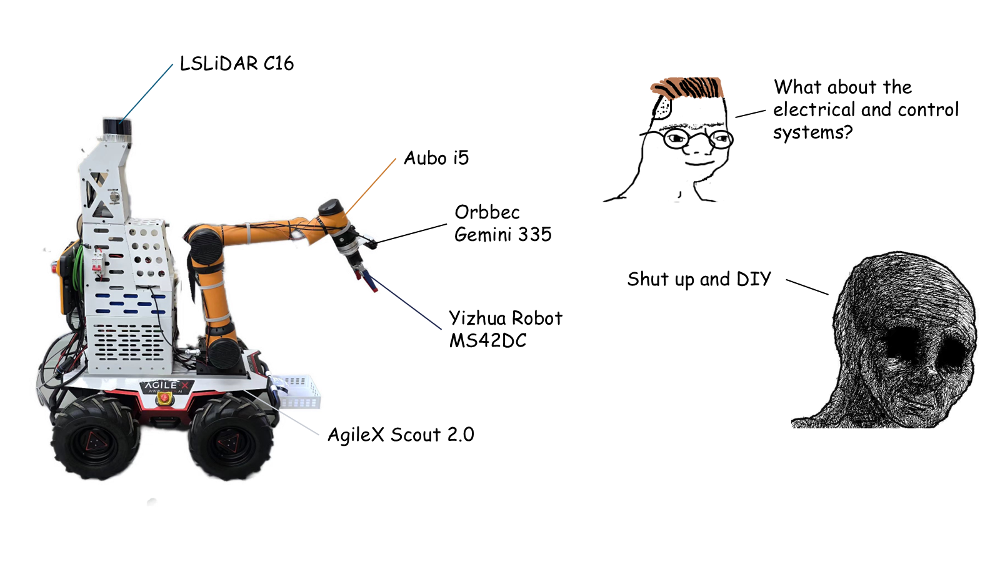

<p align="center">
  
</p>

# Arachne

[English](README.en.md) · [快速启动](#快速启动) · [真机接口](#真机接口) · [文档](#文档)


Arachne 是一个面向深度强化学习联合控制的移动操作机器人 ROS 2 workspace。默认硬件由 Scout 2.0 移动底盘、Aubo i5 机械臂、MS42DC 二指柔性伺服电机夹爪、Gemini335 RGB-D 相机、镭神智能 C16 雷达、车头吊篮和后置传感器架组成；AG95 作为可切换夹爪模型保留。

项目最终目标是形成一台能在真实场景中执行精密装配、测量和移动操作任务的联合控制小车：底盘、机械臂、夹具和视觉/雷达传感器共享状态表示，在安全约束内由传统控制、示教数据、视觉感知和深度强化学习策略逐步融合。当前 `jetson` 路线优先打牢真机流式控制、感知数据采集、可视化示教、数字孪生和边缘推理链路；早期任务线包括垃圾识别拾取入篮，以及充电枪识别、对准、拔出和插入。

<p align="center">
  
</p>

## 特性

- 统一数字孪生：Scout 2.0、Aubo i5、MS42DC、AG95、Gemini335、镭神智能 C16、后置架和车头吊篮位于同一 TF/URDF 树。
- 真机流式控制：底盘长按控制、Aubo SDK 速度控制、MS42DC 串口控制、Aubo 远程上电/启动和载荷配置均固化为脚本化流程。
- 感知与边缘推理：Gemini335 RGB-D 采集、镭神智能 C16 环境感知、YOLO26/TensorRT 工作区、实时标注窗口和 INT8 校准目录已独立组织。
- 示教与数据闭环：窗口化示教面板支持 home/install 位姿、本地配置、长按控制、示教记录和回放，为后续 imitation/RL 数据采集服务。
- 仿真与展示：RViz 模型检查、Gazebo 验证环境、Godot 高帧率展示前端，以及后续强化学习仿真接口。
- 控制骨架：MoveIt2、Nav2、ros2_control、sequence executor、VLA/WAM action chunk translator 和未来 DRL policy 节点共存。

## 快速启动

支持 Ubuntu 24.04 + ROS 2 Jazzy，兼容 Ubuntu 22.04 + ROS 2 Humble。

```bash
git clone https://github.com/zay002/Arachne.git
cd Arachne

./scripts/build/setup_ubuntu.sh
./scripts/hardware/fetch_third_party.sh

source scripts/env/arachne_env.sh
./scripts/build/build_workspace.sh
./scripts/model/view_model.sh
```

仓库随附可直接运行的第三方最小集合：Aubo i5 必要模型、Scout ROS2、UGV SDK 源码、Aubo ROS2 driver、AG95 描述和 MS42DC ROS2 示例。大型资料如完整 Aubo 全系列模型、厂家视频/安装包、UGV 大 PDF、Godot 外部素材包仍由脚本或链接下载。`fetch_third_party.sh` 默认复用随仓库携带的内容并建立符号链接；如需重新拉取固定版本完整上游，可运行 `ARACHNE_REFRESH_THIRD_PARTY=true ./scripts/hardware/fetch_third_party.sh`。

`arachne_env.sh` 会把当前 shell 固定到 ROS 使用的系统 Python，例如 Ubuntu 24.04 + Jazzy 下的 `/usr/bin/python3.12`，避免 conda/pyenv 的 Python 3.13 抢走 ROS Python 模块。

`view_model.sh` 会启动默认 MS42DC 模型、底盘遥控 GUI、Aubo 关节滑条和夹爪 Open/Close 控制窗。

推荐始终通过 `./scripts/model/view_model.sh` 查看模型；脚本会自动加载 ROS 和 workspace 环境。若手动运行 `ros2 launch` 或直接打开 RViz，必须先执行：

```bash
source scripts/env/arachne_env.sh
source install/setup.bash
```

否则 RViz 的 `package://...` mesh 路径可能解析失败，表现为白模、部件堆叠或材质丢失。

## 常用入口

| 目标 | 命令 |
| --- | --- |
| 查看默认 MS42DC 模型 | `./scripts/model/view_model.sh` |
| 查看 AG95 模型 | `./scripts/model/use_gripper.sh ag95 view` |
| 检查 URDF 和基础接口 | `./scripts/build/check_workspace.sh` |
| Gazebo 手柄 demo | `./scripts/sim/switch_demo.sh` |
| Gazebo 自主拾取验证 | `./scripts/sim/gazebo_autopick_demo.sh` |
| Godot 展示前端 | `./scripts/godot/godot_showcase.sh` |
| Gemini335 YOLO 实时标注 | `./scripts/vision/gemini_yolo_live.sh` |
| Trash 分割抓取入篮预览 | `./scripts/vision/grasp_preview.sh` |
| 真机姿态同步抓取预览 | `./scripts/vision/grasp_preview_real_sync.sh` |
| 真机同步并执行抓取 | `ARACHNE_CONFIRM_GRASP_EXECUTE_REAL=YES ./scripts/vision/grasp_preview_real_sync.sh --execute-real` |
| 抓取任务服务器 | `./scripts/vision/grasp_task_server.sh` |
| 真机抓取总控 console | `./scripts/hardware/real_grasp_console.sh --yes` |
| Agent Bridge | `./scripts/agent/agent_bridge.sh` |
| 真机环境检查 | `./scripts/hardware/check_real_hardware_env.sh` |
| 真机一键 bringup | `./scripts/hardware/real_bringup.sh` |
| 真机示教演示 | `./scripts/hardware/real_teach_demo.sh` |
| Aubo 只读连通探测 | `./scripts/hardware/real_aubo_probe.sh` |
| Aubo 启动状态确认 | `./scripts/hardware/real_aubo_prepare.sh` |
| Aubo 真机 driver 启动 | `ARACHNE_CONFIRM_AUBO_DRIVER=YES ./scripts/hardware/real_aubo_bringup.sh` |
| Aubo 阻塞远程启动 | `ARACHNE_CONFIRM_AUBO_REMOTE_START=YES ./scripts/hardware/real_aubo_remote_start.sh` |
| Aubo 小幅 Z 向测试 | `ARACHNE_CONFIRM_REAL_MOTION=YES ./scripts/hardware/real_aubo_z_test.sh` |
| 真机示教与回放面板 | `./scripts/operator/teach_panel.sh` |

<p align="center">
  
  
</p>

## 真机接口

Arachne 的真机层尽量复用官方或厂家 ROS 路线，并在本仓库内维护当前硬件需要的集成节点。

### 坐标系约定

Arachne 默认遵循 ROS 车体坐标约定：`base_link` 的 +X 指向小车前方，+Y 指向小车左侧，+Z 向上。`odom -> base_link` 来自底盘里程计，`map -> odom` 属于后续定位系统，不写进 URDF。机械臂链路挂在车体上：`base_link -> arm_mount_link -> aubo_base_link -> ... -> tool0 -> gripper_adapter_link -> grasp_frame`；其中 `aubo_base_link` 是 Aubo 底座坐标，`tool0` 是法兰中心，`grasp_frame` 是夹具中心/抓取 TCP。末端相机挂在 `tool0` 下方，RGB-D ROI 点先在相机深度 frame 中按深度投影得到，再经 TF 转成 `base_link` 下的抓取目标。抓取预览的补偿量 `ARACHNE_GRASP_BASE_OFFSET` 是 `base_link` 下的 `(x,y,z)` 米制偏置，默认 `0,0,0`；长期偏差应通过 `scripts/vision/apriltag_hand_eye_calibration.sh` 求真实手眼外参。真机抓取执行默认在投放开爪后回到 `scripts/env/arachne_real_defaults.sh` 中的 home 姿态。

| 设备 | 默认接口 | 说明 |
| --- | --- | --- |
| Scout 2.0 | `scout_waveshare_serial_driver` | `/cmd_vel` 到 Scout v2 CAN 帧；Waveshare USB-CAN-A，CH340 串口，默认 `/dev/serial/by-id/usb-1a86_USB_Serial-if00-port0` |
| MS42DC | `ms42dc_direct_serial_driver` | `/arachne/gripper/command` 到 Type-C 串口帧；夹具控制板为 CH91xx/CH343 系列，当前实机按 CH9012 路线处理，推荐别名 `/dev/motor_serial` |
| Aubo i5 | `AuboRobot/aubo_ros2_driver` | TCP/IP + ros2_control，按机器人 IP 启动 |
| Gemini335 | `arachne_sensors` | 末端 RGB-D 相机，用于目标分割、mask/depth ROI、抓取位姿估计和示教观测 |
| 镭神智能 C16 | `arachne_description` / 后续雷达驱动 | 后置架雷达模型已纳入 TF 树，后续用于障碍感知、定位辅助和移动操作安全约束 |

准备真机相关 ROS 包：

```bash
./scripts/hardware/prepare_real_hardware_ros.sh
./scripts/hardware/real_aubo_probe.sh
./scripts/hardware/real_aubo_prepare.sh
```

Aubo 推荐优先在示教器/控制柜上完成“连接 -> 上电 -> 启动”。如果需要从 ROS 侧远程启动，只使用阻塞式脚本：它会先确认 controller active、读取当前关节角并发送 hold-position，再按“上电 -> Aubo `RobotManage.startup` 完整启动 -> Running 后稳定与保持校验”的顺序执行。脚本不会直接调用 `releaseRobotBrake`；任何保护状态、超时或 controller 异常都会退出。

远程启动需要两个终端：

```bash
# 终端 1：启动 driver，并允许上电前激活 controller
ARACHNE_CONFIRM_AUBO_DRIVER=YES ARACHNE_AUBO_ALLOW_PRESTART=YES ./scripts/hardware/real_aubo_bringup.sh

# 终端 2：执行阻塞式远程启动状态机
ARACHNE_CONFIRM_AUBO_REMOTE_START=YES AUBO_ROBOT_IP=192.168.127.128 ./scripts/hardware/real_aubo_remote_start.sh
```

日常真机启动优先使用自动入口。脚本会自动选择 Scout 和 MS42DC 的 `/dev/serial/by-id` 串口，检查 Aubo 是否处于 Running / Normal，然后启动完整 bringup：

```bash
./scripts/hardware/real_bringup.sh
```

WSL2 用户推荐使用 [hurry-porter](https://github.com/zay002/hurry-porter) 辅助 USB 透传、串口扫描和 Waveshare USB-CAN-A 诊断。`real_bringup.sh` 找不到串口时会先尝试自动 attach CH9102/CH340 设备；如果 Windows 侧还没有共享设备，再按脚本提示手动 attach。

```bash
hurry scan
hurry waveshare-can-a recv \
  --port /dev/serial/by-id/usb-1a86_USB_Serial-if00-port0 \
  --can-bitrate 500000 \
  --frame-type standard \
  --duration 2
```

真机运动测试默认 dry-run。确认电源、急停和空间安全后再显式允许运动：

```bash
./scripts/hardware/real_hardware_acceptance_test.sh
./scripts/hardware/real_aubo_z_test.sh
ARACHNE_CONFIRM_REAL_MOTION=YES ./scripts/hardware/real_hardware_acceptance_test.sh
```

示教演示可直接一键启动：

```bash
./scripts/hardware/real_teach_demo.sh
```

它会启动真机 bringup，等待 `/odom`、`/joint_states`、Aubo trajectory action 和夹具状态可用后打开示教面板；关闭面板时会自动停止 bringup。面板可以手动控制底盘、Aubo 末端和 MS42DC，支持 Aubo Teach On/Off、RX/RY/RZ 腕部微调、底盘长按松开后自动记录相对移动段、等待步骤、单点更新和 waypoint 复用，并将记录保存到本地 `recordings/teach/` 后一键回放。

## 项目结构

| 路径 | 内容 |
| --- | --- |
| `src/arachne_description` | 统一机器人模型、RViz 配置、夹爪变体和传感器坐标系 |
| `src/arachne_sensors` | Gemini335 RGB-D 相机节点、C16 雷达接入预留和传感器 launch |
| `src/arachne_demo` | Switch Pro 手柄、Gazebo 展厅、自主拾取验证 |
| `src/arachne_hardware` | 真机 bringup、Scout/MS42DC wrapper、安全状态和命令门控 |
| `src/arachne_control` | ros2_control 控制器命名、mock 控制器和硬件 profile |
| `src/arachne_moveit_config` | Aubo i5 + MS42DC/AG95 的 MoveIt2 起步配置 |
| `src/arachne_nav` | Scout Nav2 起步配置 |
| `src/arachne_operator` | 操作员面板、grasp task server、sequence executor、VLA/WAM action chunk translator |
| `src/arachne_agent_bridge` | 外部 Agent 的安全工具白名单、示教式控制桥和状态快照 |
| `scripts/env` / `scripts/build` | ROS 环境和 colcon 构建入口 |
| `scripts/hardware` / `scripts/operator` | 真机 bringup、验收、Aubo 辅助脚本和示教入口 |
| `scripts/vision` | Gemini335、YOLO26 segmentation、TensorRT、INT8 校准和实时分割入口 |
| `scripts/model` / `scripts/sim` / `scripts/godot` | 模型检查、仿真演示和 Godot 展示脚本 |
| `yolo_workspace` | YOLO 专用 venv、权重、engine、数据集和校准图片目录 |
| `godot/arachne_showcase` | Godot 4.x 第三人称展示前端 |
| `docs` | 建模、控制、硬件、标定和参考资料 |

`scripts/` 根目录不再放置旧式兼容脚本；请直接使用分类路径，例如 `./scripts/hardware/real_full_teach.sh` 和 `source scripts/env/arachne_env.sh`。

## 文档

- [建模](docs/modeling.zh-CN.md)
- [控制](docs/control.zh-CN.md)
- [硬件](docs/hardware.zh-CN.md)
- [标定](docs/calibration.zh-CN.md)
- [抓取任务服务器](docs/grasp_task_server.zh-CN.md)
- [Agent Bridge](docs/agent_platform.zh-CN.md)
- [任务路线：垃圾拾取与充电枪拔插](docs/task_tracks.zh-CN.md)
- [参考资料](docs/references.zh-CN.md)

英文版本位于同名文档，例如 [docs/hardware.md](docs/hardware.md)。

## Roadmap

- **真机可靠性层**：继续稳定 Scout、Aubo、MS42DC、Gemini335 和镭神智能 C16 的一键 bringup、远程上电、载荷配置、流式速度控制和安全停止。
- **感知与任务层**：采集 Gemini335 RGB-D 与 C16 雷达数据，微调 YOLO26 垃圾/工件/充电枪分割模型，建立 INT8 TensorRT、mask/depth ROI 定位、抓取任务服务器和本地数据集闭环。
- **静态操作任务**：在底盘静止时并行推进两条任务线：垃圾识别、抓取、放入车头吊篮；充电枪识别、精密对准、拔出和插入。随后扩展到工件识别、测量点定位和简单装配位姿生成。
- **移动操作任务**：将底盘定位、机械臂可达性、车体姿态、视觉观测和 C16 环境信息统一到任务状态，做移动后停车、观察、抓取、充电枪拔插和测量的闭环流程。
- **深度强化学习联合控制**：在仿真和真实示教数据上训练底盘-机械臂-夹具联合策略，优先覆盖精密对位、充电枪拔插、装配和测量任务，再逐步迁移到真机。
- **评测与安全**：建立任务成功率、轨迹平滑度、定位误差、接触力/抖动、安全区违规和恢复策略等指标，形成可重复验收流程。

## License

本仓库代码使用 [MIT License](LICENSE)。第三方模型、CAD、SDK 和说明书遵循各自来源许可证；来源记录见 [third_party/README.md](third_party/README.md) 和 [docs/references.zh-CN.md](docs/references.zh-CN.md)。
