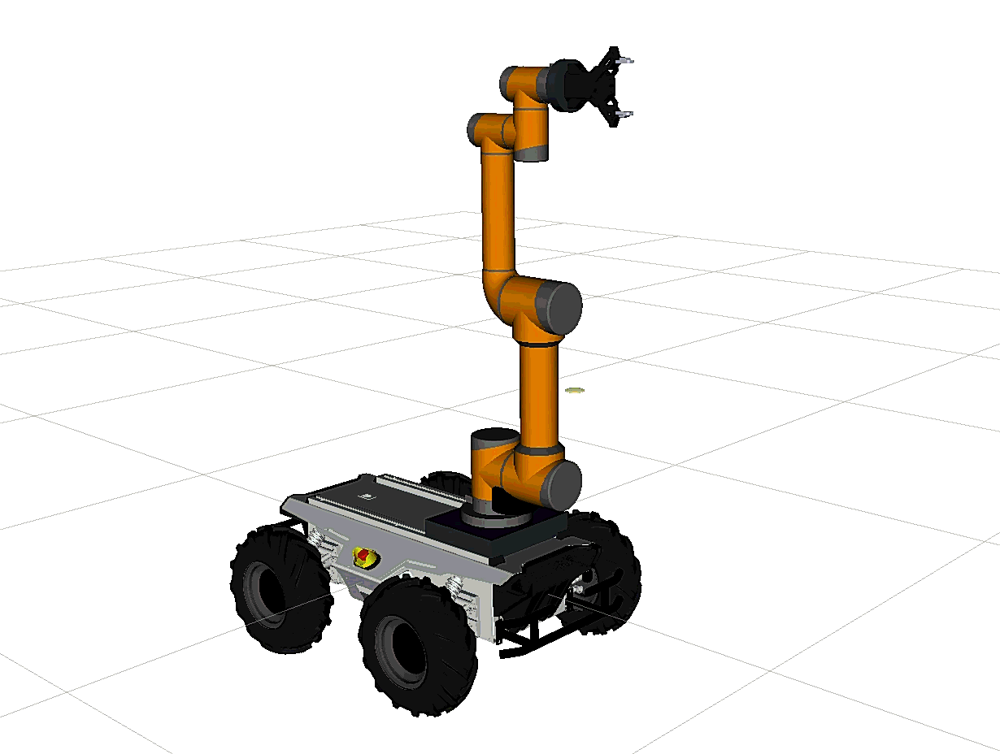

<p align="center">
  
</p>

# Arachne

Arachne is a Linux-native ROS2 framework for a Scout 2.0 + Aubo i5 mobile manipulator with an MS42DC flexible gripper.

The first milestone is the robot model: one inspectable `robot_description`, one connected TF tree, and launch files that show the full robot in RViz. Control, MoveIt2, simulation, and Web UI will build on top of this model after the frames and dimensions are stable.

## Current Status

Implemented:

- `arachne_description` ROS2 package.
- Unified Xacro model using the AgileX Scout v2 description, the AuboRobot Aubo i5 description, the MS42DC STEP-derived mesh, mounts, lidar, and optional end-effector camera.
- RViz display launch with `joint_state_publisher`.
- Reproducible Ubuntu setup and model-check scripts.
- Stage reports in `docs/reports/`.

Still pending:

- The previous placeholder gripper has been replaced by the real MS42DC visual mesh converted from `third_party/MS42DC.step`.
- Mount transforms reflect the current intended hardware layout and should be rechecked if the physical mount changes.
- MS42DC motion/control integration, MoveIt2 config, simulation backend, and Web dashboard are not implemented yet.

## Repository Layout

```text
Arachne/
├── src/arachne_description/   # ROS2 description package
├── src/vendor/                 # symlinks to vendored model packages
├── docs/                      # hardware, modeling, calibration, control notes
├── docs/reports/              # short reports after each completed stage
├── scripts/                   # setup and validation helpers
├── third_party/               # downloaded upstream model packages
├── plan.md                    # development plan
└── README.md
```

## Environment

Recommended:

- Ubuntu 22.04 + ROS2 Humble
- Ubuntu 24.04 + ROS2 Jazzy

Install dependencies:

```bash
cd Arachne
./scripts/setup_ubuntu.sh
source /opt/ros/humble/setup.bash  # use /opt/ros/jazzy/setup.bash on Ubuntu 24.04
colcon build --symlink-install
source install/setup.bash
```

The setup script selects Humble on Ubuntu 22.04 and Jazzy on Ubuntu 24.04. You can override it with `ROS_DISTRO=humble` or `ROS_DISTRO=jazzy`; source the matching `/opt/ros/<distro>/setup.bash`.

The required upstream model packages are included under `third_party/` in this working tree:

- `AuboRobot/aubo_description`
- `agilexrobotics/scout_ros2/scout_description`

If they are missing, run:

```bash
./scripts/fetch_third_party.sh
```

## Run The Model

Build the description packages and launch RViz:

```bash
cd Arachne
source /opt/ros/jazzy/setup.bash
colcon build --base-paths src --packages-select \
  aubo_description scout_description arachne_description
source install/setup.bash
ros2 launch arachne_description display.launch.py
```

For Ubuntu 22.04, source `/opt/ros/humble/setup.bash` instead.

If the RViz window opens before the robot appears, wait a few seconds. The model is loaded from `/robot_description`, and the first render may lag while mesh resources are loaded.

Quick relaunch after a previous build:

```bash
ros2 launch arachne_description display.launch.py
```

Useful launch arguments:

```bash
ros2 launch arachne_description display.launch.py \
  arm_mount_xyz:="0.22 0.0 0.155" \
  arm_mount_rpy:="0.0 0.0 1.57079632679" \
  with_lidar:=true \
  with_ee_camera:=false
```

## Validate

```bash
./scripts/check_model.sh
ros2 run tf2_tools view_frames
```

`check_model.sh` writes `/tmp/arachne.urdf` and runs `check_urdf` when that tool is installed.

## Model Structure

The intended frame chain is:

```text
base_link
├── base_footprint
├── arm_mount_link
│   └── aubo_base_link
│       └── ... └── tool0
│                   └── gripper_adapter_link
│                       └── ms42dc_body_link
│                           └── grasp_frame
├── lidar_link
├── inertial_link
└── wheel links
```

`map -> odom -> base_link` is not part of the URDF. It will come from localization and odometry later.

## Mount Pose

The current Aubo-on-Scout pose is the intended mounting pose for this hardware configuration.

Default:

```text
base_link -> arm_mount_link:
  xyz = 0.22 0.0 0.155
  rpy = 0.0 0.0 1.57079632679
```

Why this value is used:

- `base_link` is the Scout v2 root frame from `agilexrobotics/scout_ros2`.
- `z=0.155` places the Aubo mount at the configured top-deck height.
- `x=0.22` places the arm forward on the Scout top deck.
- `yaw=90 deg` sets the Aubo base orientation relative to the Scout base.

## Gripper Model

The MS42DC source CAD is kept as `third_party/MS42DC.step` in the local workspace. RViz cannot load STEP directly, so the committed runtime mesh is:

```text
src/arachne_description/meshes/gripper/ms42dc/MS42DC.stl
```

It was generated with:

```bash
sudo apt-get install -y gmsh
./scripts/convert_ms42dc_step.sh
```

The STL uses millimeters from the original CAD and is scaled to meters in `urdf/gripper/ms42dc.urdf.xacro`.

For open-source users who do not have access to the MS42DC CAD, DH Robotics AG95 is a practical alternative gripper to evaluate. Its ROS2 description has been tested in earlier Arachne model iterations through `ian-chuang/dh_ag95_gripper_ros2`; the current default model remains MS42DC because it matches this hardware.

If the physical mounting plate changes, test a different pose without editing files:

```bash
ros2 launch arachne_description display.launch.py \
  arm_mount_xyz:="0.20 0.00 0.16" \
  arm_mount_rpy:="0.0 0.0 1.57079632679"
```

## Stage Reports

- `docs/reports/stage_0_repository_foundation.md`
- `docs/reports/stage_1_unified_robot_model.md`
