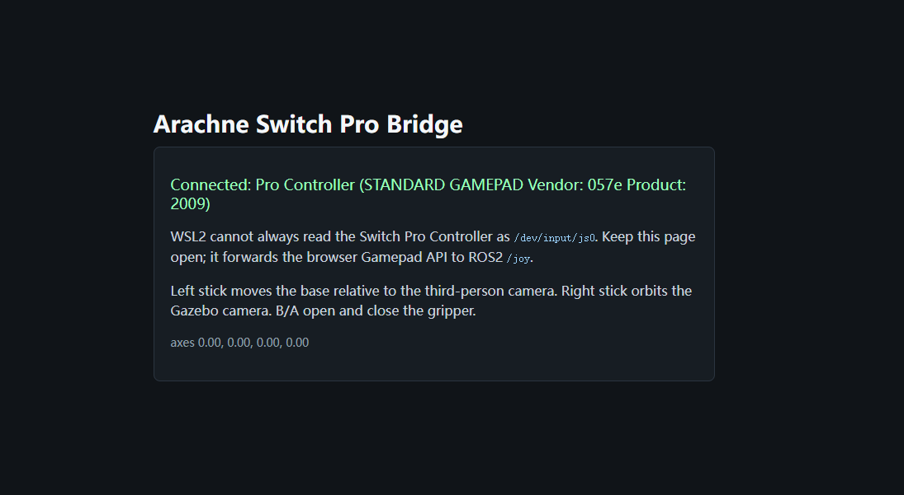

<p align="center">
  
</p>

# Arachne 中文说明

Arachne 是一个面向 Scout 2.0 移动底盘、Aubo i5 机械臂和可切换夹爪的 ROS2 workspace。当前默认硬件模型是 Scout 2.0 + Aubo i5 + 易爪机器人二指柔性伺服电机夹爪（MS42DC）；AG95 作为开源夹爪模型保留，用于对比和演示。

两套模型的底盘、机械臂、安装位姿、传感器占位、启动流程和夹爪控制接口都相同，唯一差异是 `gripper_adapter_link` 后面的夹爪模型。MS42DC 和 AG95 在演示界面里都只提供 `Open` / `Close` 两个状态。

## 我们提供了什么

- `src/arachne_description`：统一的 Xacro/URDF 机器人模型、RViz 配置、模型变体、安装框架和传感器框架。
- `src/arachne_sim`：面向 RViz 的底盘仿真，负责 `/cmd_vel` 积分、里程计 TF、轮子 joint state 和底盘遥控 GUI。
- `src/arachne_gripper`：夹爪仿真控制器、joint-state mux，以及只有 `Open` / `Close` 的小型 GUI。
- `src/arachne_demo`：Nintendo Switch Pro 手柄遥控、RViz demo 启动和 Gazebo 展示世界。
- `src/arachne_gazebo`：Gazebo 专用辅助节点，用于更流畅的 GUI 相机跟随，以及 demo 中的机械臂/夹爪控制桥。
- `src/arachne_hardware`：预留真机驱动包，包含空的夹具串口、底盘串口、Aubo TCP/IP 驱动文件。
- `godot/arachne_showcase`：Godot 4.x 高帧率展示前端，包含视觉 teleop、跟随相机、机械臂预设姿态和 ROS2 bridge 占位接口。
- `scripts`：环境安装、第三方模型下载、可视化启动、URDF 检查和夹爪仿真测试脚本。
- `docs`：硬件、建模、控制、标定说明，以及阶段报告。
- `docs/demo/arachne.png`：项目首页宣传图。
- `docs/demo/model_compare.png`：MS42DC 与 AG95 两套夹爪模型展示图。
- `third_party/MS42DC.step`：MS42DC 原始 CAD。
- `third_party/MS42DC_SPLIT/*.stl`：由项目作者手动拆分制作的 MS42DC 可动部件模型，用于真实开合可视化。

外部模型依赖由 `scripts/fetch_third_party.sh` 按固定版本恢复，保证新环境可以复现。`build/`、`install/` 和 `log/` 是 colcon 在本地构建时生成的标准输出目录。

## 当前状态

- 已完成 Scout 2.0 + Aubo i5 + MS42DC/AG95 的统一 `robot_description`。
- Aubo 安装在当前硬件确认的 Scout 顶部位置。
- MS42DC 使用作者手动拆分的真实 CAD 部件，左右夹指可以绕真实铰点开合。
- MS42DC 默认闭合角为 `0.6 rad`。
- RViz 通过 `scripts/view_model.sh` 启动，会自动清理旧的可视化节点，并打开底盘遥控、机械臂关节滑条、夹爪仿真和 Open/Close 控制窗。
- 机械臂滑条 GUI 默认从当前用户确认的展示姿态启动；点击 `Center` 会回到这个姿态。
- `scripts/switch_demo.sh` 默认启动 Gazebo 展厅 demo，可以用 Nintendo Switch Pro 手柄控制底盘、平滑第三人称视角、Aubo 关节和夹爪。Gazebo 会使用专门的 Scout 轮子物理姿态，确保前进输入时四个轮子同向驱动。
- `scripts/godot_showcase.sh` 可启动单独的 Godot 4.x 高帧率展示前端，适合宣传展示；它使用轻量运动学和插值，不追求接触物理精度。

## Roadmap

1. 完成物理标定：末端转接板、传感器位姿和用于规划的简化碰撞模型。
2. 为 Aubo + MS42DC/AG95 两种末端配置 MoveIt2。
3. 将 Gazebo demo 升级为主要物理预演后端，接入 ros2_control 机械臂和夹爪控制器。
4. 通过已预留的 bridge 接口，把 Godot 展示前端连接到 ROS2 或 MuJoCo。
5. 真机材料到齐后，实现 Aubo TCP/IP、Scout 串口、MS42DC 串口硬件接口。
6. 在模型、控制器和 launch 接口稳定后，再构建 Web 操作界面。

## 快速启动

推荐环境：

- Ubuntu 24.04 + ROS2 Jazzy
- Ubuntu 22.04 + ROS2 Humble

```bash
cd Arachne
./scripts/setup_ubuntu.sh
./scripts/fetch_third_party.sh

conda deactivate 2>/dev/null || true
source /opt/ros/jazzy/setup.bash  # Ubuntu 22.04 使用 /opt/ros/humble/setup.bash

colcon build --base-paths src --packages-select \
  aubo_description scout_description dh_ag95_description \
  arachne_sim arachne_gripper arachne_hardware arachne_description arachne_gazebo arachne_demo \
  --cmake-args -DPython3_EXECUTABLE=/usr/bin/python3

source install/setup.bash
./scripts/view_model.sh
```

底盘遥控 GUI 会发布 `/cmd_vel`，底盘仿真节点会发布 `/odom`、`odom -> base_link` 和轮子 joint state。

如果看到 Aubo 折叠到 Scout 车体里，先重新构建并用 helper 脚本启动，确保安装目录里的 launch 文件是最新的：

```bash
colcon build --base-paths src --packages-select arachne_description
source install/setup.bash
./scripts/view_model.sh
```

也可以直接用命令控制底盘：

```bash
ros2 topic pub --rate 10 /cmd_vel geometry_msgs/msg/Twist \
  "{linear: {x: 0.25}, angular: {z: 0.0}}"
```

查看 AG95 版本：

```bash
GRIPPER_TYPE=ag95 GRIPPER_SIM_PROFILE=ag95 ./scripts/view_model.sh
```

## Switch 手柄 Demo

先通过蓝牙连接 Nintendo Switch Pro 手柄，然后运行可玩的 Gazebo 展厅 demo：

```bash
./scripts/switch_demo.sh
```

在正常 Linux 中，`switch_demo.sh` 会优先使用 `/dev/input/js0`。在 WSL2 中，或者系统里没有 joystick 设备时，它会自动启动浏览器桥接：

```bash
./scripts/switch_demo.sh
# 然后在 Windows 或 Linux 浏览器打开 http://127.0.0.1:8787
```

也可以手动指定输入方式：

```bash
INPUT_BACKEND=joy JOY_DEV=/dev/input/js1 ./scripts/switch_demo.sh
INPUT_BACKEND=web ./scripts/switch_demo.sh
```

对于 Switch Pro 手柄，WSL2 下通常优先推荐浏览器桥接，因为手柄保持连接在 Windows 蓝牙侧，再由浏览器把标准 Gamepad 状态转发到 ROS2。

<p align="center">
  
</p>

如果只想打开轻量 RViz 控制视图：

```bash
DEMO_MODE=rviz ./scripts/switch_demo.sh
```

默认按键：

- 左摇杆：按小车自身坐标连续控制 Scout；摇杆半径决定瞬时速度，纵向分量控制前进/后退，横向分量控制转向。
- 右摇杆：围绕机器人旋转平滑的 Gazebo 跟随相机；在 RViz 模式下旋转 RViz 跟随视角。
- 按住 `ZL` + 十字键上下：移动当前选中的 Aubo 关节。
- `L` / `R`：切换上一个/下一个 Aubo 关节。
- `B`：打开夹爪。`A`：闭合夹爪。
- `+` 或浏览器 `RESET` 按钮：重置底盘、机械臂、夹爪和 Gazebo demo 位姿。`-`：底盘停止。

默认 Gazebo 版本只打开 Gazebo 展厅窗口，不启动 RViz：它加载真实机器人 mesh、轻量化物理展厅、可碰撞物体、diff-drive 物理插件、Gazebo `/gz/odom`、手柄控制的第三人称相机，以及 Aubo 关节微调和 MS42DC 开闭控制桥。完整 ros2_control/Gazebo 控制栈会在后续继续补齐。

<p align="center">
  
</p>

相机距离可以不重新构建直接微调：

```bash
GAZEBO_CAMERA_DISTANCE=1.7 ./scripts/switch_demo.sh
```

如果其他手柄上报的左摇杆 Y 轴刚好相反，可以不重新构建直接切换：

```bash
FORWARD_AXIS_SIGN=1.0 ./scripts/switch_demo.sh
```

手动调 MS42DC 闭合角：

```bash
WITH_GRIPPER_SIM=false WITH_GRIPPER_GUI=false ./scripts/view_model.sh
```

拖动 `ms42dc_left_finger_joint`，右指会通过 mimic 反向跟随。默认值已经是 `0.6 rad`，临时覆盖可以这样启动：

```bash
GRIPPER_CLOSED_POSITION=0.58 ./scripts/view_model.sh
```

## Godot 展示前端

Godot 前端用于高帧率演示和宣传视频，不替代 Gazebo 物理仿真。它通过本地链接复用现有 Scout 2.0、Aubo i5、MS42DC、AG95 和场景物件 mesh，并提供键盘/手柄底盘控制、跟随相机、简单障碍物、MS42DC 开闭动画和 Aubo 预设姿态插值。

```bash
./scripts/install_godot4.sh   # 如果已经安装 godot4，可以跳过
./scripts/fetch_third_party.sh
./scripts/godot_showcase.sh
```

如果 Godot 不在 `PATH` 中，可以设置 `GODOT_BIN=/path/to/godot4`。启动脚本会先准备本地 mesh 链接和生成的 GLB 缓存文件，再打开 Godot。控制方式和 bridge 说明见 `godot/arachne_showcase/README.md`。

## 常用检查

```bash
./scripts/check_model.sh
./scripts/test_gripper_sim.sh
```

重置底盘仿真位姿：

```bash
ros2 service call /arachne/base/reset std_srvs/srv/Trigger {}
```

如果 RViz 只看到网格，优先用 `./scripts/view_model.sh` 重新启动；这个脚本会清理旧的 RViz、robot_state_publisher 和 joint_state_publisher 节点。模型加载可能需要等待几秒。
